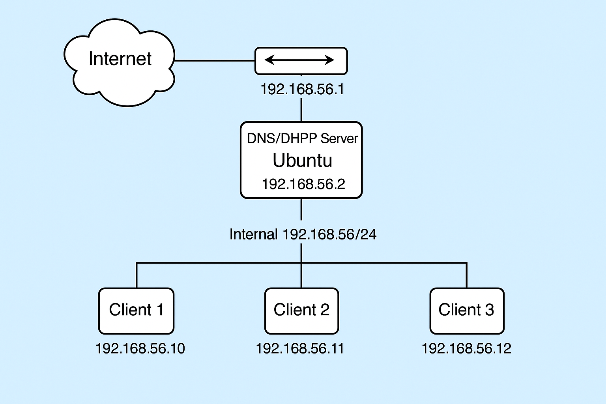
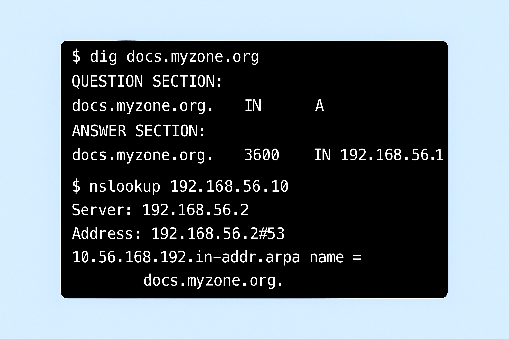
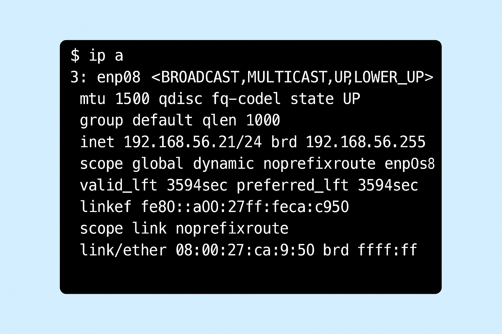

# Servidor DNS e DHCP Interno em Linux

Este projeto tem como objetivo a implantação de um servidor DNS com Bind9 e um servidor DHCP com isc-dhcp-server em um ambiente Linux (Ubuntu Server), simulando uma rede local corporativa. É ideal para estudos e demonstrações em ambientes virtuais ou laboratoriais.

## 🧰 Tecnologias Utilizadas

- Ubuntu Server 20.04+
- Bind9 (servidor DNS)
- isc-dhcp-server (servidor DHCP)
- Shell Script (automação da instalação e configuração)

## 📌 Pré-Requisitos

- Máquina Ubuntu Server (pode ser uma VM)
- Acesso root ou sudo
- Conexão com a internet (para instalação dos pacotes)

## ⚙️ Instalação e Configuração

1. Clone este repositório:
```bash
git clone https://github.com/ThomazLCavalcanti/dns-dhcp-server-linux.git
cd dns-dhcp-server-linux
```

2. Torne o script executável e execute:
```bash
chmod +x scripts/install_config.sh
sudo ./scripts/install_config.sh
```

3. O script instalará os pacotes e aplicará as configurações automaticamente.

## 🌐 Domínio e Sub-rede Utilizados

- Domínio fictício: `exemplo.local`
- Sub-rede: `192.168.50.0/24`
- Intervalo DHCP: `192.168.50.100` até `192.168.50.200`

## 🧪 Testes e Validações

- `ping servidor.exemplo.local` (resolução via DNS)
- `ip a` e `ip r` para verificar IP via DHCP
- Verificações com `nslookup`, `dig`, `systemctl status`

Imagens de teste disponíveis na pasta `docs/`.

## 📸 Imagens





## 📄 Licença

Este projeto está licenciado sob a licença MIT. Consulte o arquivo LICENSE para mais informações.
